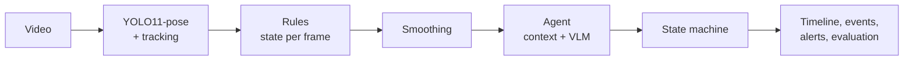

# Bed Monitor

An agentic vision system that watches indoor video of an elderly person and reports what they are doing over time, when they leave or return to bed, how long they spend in each state, and whether anything needs monitoring or an alert.

## How it works



YOLO finds the person and their body keypoints. Simple rules turn posture and position into a state per frame, smoothing removes flicker, and an agent resolves unclear moments by looking at nearby frames or asking a vision-language model on Amazon Bedrock. A state machine blocks impossible transitions, and the results become a timeline, bed events, and a NORMAL / MONITOR / ALERT decision.

| Decision | When | Why |
|---|---|---|
| NORMAL | Lying, sitting, standing, or walking normally; assisted bed exit | Expected activity |
| MONITOR | Unassisted bed exit, sitting on the bed edge > 2 min, state unknown > 30 s, out of view > 1 min | Higher fall risk, or the system can't vouch for the person's safety |
| ALERT | Lying outside the bed ≥ 5 s, out of bed > 10 min | Possible fall, or unexpected prolonged absence |

## Setup

```bash
bash setup.sh
source .venv/bin/activate
```

Fill in `.env` (created from `.env.example`) for the vision-language model. Never commit it.

```
AWS_BEARER_TOKEN_BEDROCK=<your Amazon Bedrock API key>
OPENAI_BASE_URL=https://bedrock-mantle.<region>.api.aws/v1
OPENAI_PROJECT_ID=<optional>
VLM_MODEL=<vision-capable model id>
```

To get these from AWS:

1. In the AWS console, open **Amazon Bedrock → API keys** and generate a **long-term API key**. Set an expiry and copy the key into `AWS_BEARER_TOKEN_BEDROCK`.
2. Set `OPENAI_BASE_URL` to the OpenAI-compatible endpoint for your region, e.g. `https://bedrock-mantle.us-east-1.api.aws/v1`.
3. Run `python -m bedmonitor.list_models` and set `VLM_MODEL` to a model that accepts image input. If a model is missing, enable it under **Model access** in the Bedrock console.

Revoke the key in the Bedrock console when you no longer need it. Without these settings, everything still runs; unclear moments are resolved from context only.

## Videos and ground truth

| What | Where | Example |
|---|---|---|
| Videos | `data/videos/` | `data/videos/IMG_5674.MOV` |
| Ground truth | `data/ground_truth/<video name>.csv` | `data/ground_truth/IMG_5674.csv` |

Ground truth is optional, but needed for accuracy and evaluation results. Each row is a time segment, covering the whole video without gaps:

```csv
start_sec,end_sec,state
0,45,LYING_IN_BED
45,58,SITTING_ON_BED
58,62,STANDING
62,80,WALKING
80,180,LYING_IN_BED
```

Allowed states: `LYING_IN_BED`, `SITTING_ON_BED`, `SITTING_OUTSIDE_BED`, `STANDING`, `WALKING`, `OUT_OF_BED`, `LYING_OUTSIDE_BED`, `UNKNOWN`.

## Run the UI

```bash
uvicorn app:app --reload
```

Open http://localhost:8000, choose a video, optionally choose its ground-truth CSV, and click **Analyze video**. An uploaded CSV is saved as `data/ground_truth/<video name>.csv`; without one, an existing file there is used. The page shows the decision, a timeline, time in each state, bed exits and returns, alerts, the agent's reasoning, and evaluation results if ground truth exists. Long videos can take a few minutes.

## Run the notebook

```bash
jupyter lab
```

Open `notebooks/bed_monitor_walkthrough.ipynb`, set `VIDEO` in the first cell to your file in `data/videos/`, and run all cells. It builds the pipeline step by step with a plot at each stage, which is the easiest way to see how the system reaches its decisions.

## Batch run and report

To process every video in `data/videos/` and collect the results:

```bash
python -m bedmonitor.cli
python -m bedmonitor.report
```

Results for each video go to `outputs/<video name>/`: timeline, duration summary, bed events, alerts, agent reasoning, and evaluation. `REPORT.md` gathers them in one place.

## Failure cases

Three analyzed failure cases, with images, causes, and fixes, are in [`docs/Failure_Cases.pdf`](docs/Failure_Cases.pdf).

