# Results report

Generated from `outputs/`. Rerun `python -m bedmonitor.report` after new runs.

## Overview

| video | duration_sec | bed_exits | bed_returns | decision | accuracy | mean_duration_error_sec | bed_exit_precision | bed_exit_recall |
|---|---|---|---|---|---|---|---|---|
| IMG_5672 | 32.1 | 0 | 0 | NORMAL | 0.371 | 10.0 | None | 0.0 |
| IMG_5673 | 27.2 | 0 | 0 | NORMAL | 0.833 | 2.1 | None | 0.0 |
| IMG_5674 | 20.5 | 1 | 0 | NORMAL | 0.325 | 9.2 | 0.0 | 0.0 |


## IMG_5672

### Timeline
```
00:00 - 00:04  LYING_IN_BED
00:04 - 00:06  SITTING_OUTSIDE_BED
00:06 - 00:08  SITTING_ON_BED
00:08 - 00:10  SITTING_OUTSIDE_BED
00:10 - 00:32  SITTING_ON_BED
```

### Activity summary
```json
{
  "total_observation_time": "32s",
  "activity_summary": {
    "lying_in_bed": "4s",
    "sitting_outside_bed": "4s",
    "sitting_on_bed": "25s"
  },
  "bed_summary": {
    "time_in_bed": "28s",
    "time_out_of_bed": "4s",
    "bed_exit_count": 0
  }
}
```

```json
{
  "observation_duration_sec": 32.1,
  "activity_duration_sec": {
    "lying_in_bed": 3.5,
    "sitting_outside_bed": 4.0,
    "sitting_on_bed": 24.6
  },
  "bed_exit_count": 0,
  "bed_return_count": 0,
  "total_in_bed_sec": 28.1,
  "total_out_of_bed_sec": 4.0,
  "longest_out_of_bed_period_sec": 2.5,
  "final_state": "sitting_on_bed",
  "overall_decision": "NORMAL"
}
```

### Bed events

_none_


### Alerts (overall: NORMAL)

_none_


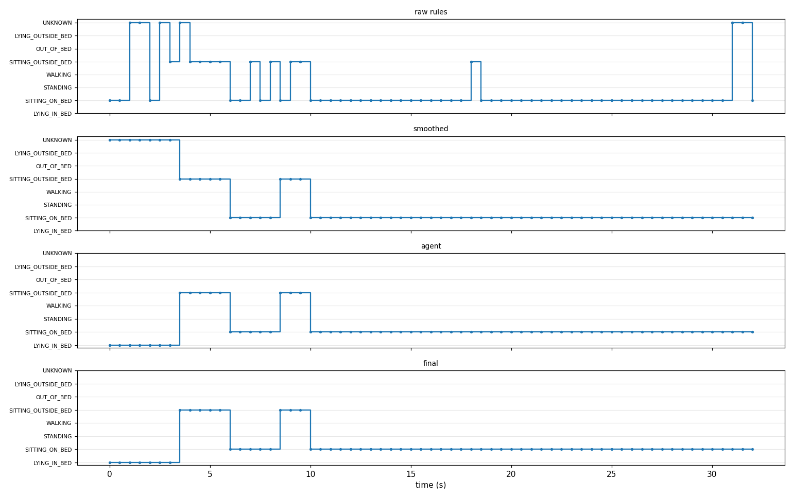


### Evaluation

Frame accuracy: **0.371** over 62 sampled frames.


| stage | accuracy | unknown_frames |
|---|---|---|
| raw rules | 0.258 | 4 |
| + smoothing | 0.258 | 7 |
| + agent (VLM) | 0.371 | 0 |
| + state machine | 0.371 | 0 |


Duration error


| state | ground_truth_sec | predicted_sec | error_sec |
|---|---|---|---|
| LYING_IN_BED | 20.0 | 3.5 | 16.5 |
| SITTING_ON_BED | 8.0 | 24.6 | 16.6 |
| STANDING | 3.0 | 0.0 | 3.0 |
| SITTING_OUTSIDE_BED | 0.0 | 4.0 | 4.0 |


Bed events


| event | ground_truth | predicted | true_positives | precision | recall | false_detections_at |
|---|---|---|---|---|---|---|
| bed_exit | 1 | 0 | 0 | None | 0.0 | [] |
| return_to_bed | 0 | 0 | 0 | None | None | [] |


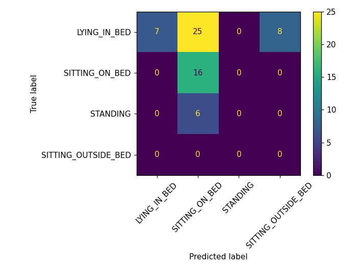


### Failure cases


**00:04–00:20**: truth `LYING_IN_BED`, predicted `SITTING_ON_BED`. Features: {'people': 2, 'visible_kp': 16, 'torso_angle': 68, 'knee_angle': 83, 'hip_in_bed': True}. Why: TODO: explain the cause

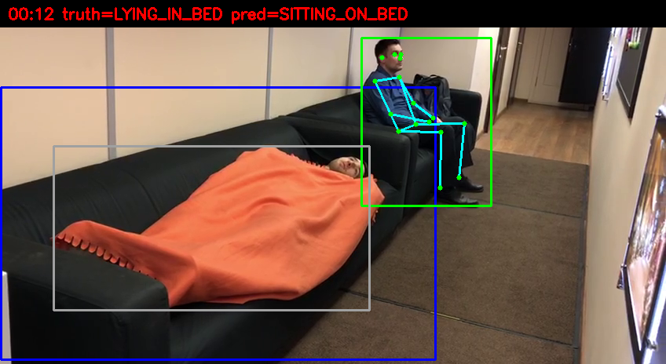


**00:28–00:30**: truth `STANDING`, predicted `SITTING_ON_BED`. Features: {'people': 2, 'visible_kp': 16, 'torso_angle': 70, 'knee_angle': 82, 'hip_in_bed': True}. Why: TODO: explain the cause

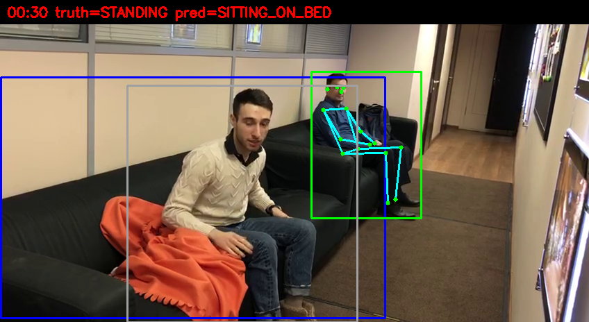


## IMG_5673

### Timeline
```
00:00 - 00:20  LYING_IN_BED
00:20 - 00:27  SITTING_ON_BED
```

### Activity summary
```json
{
  "total_observation_time": "27s",
  "activity_summary": {
    "lying_in_bed": "20s",
    "sitting_on_bed": "8s"
  },
  "bed_summary": {
    "time_in_bed": "27s",
    "time_out_of_bed": "0s",
    "bed_exit_count": 0
  }
}
```

```json
{
  "observation_duration_sec": 27.2,
  "activity_duration_sec": {
    "lying_in_bed": 19.5,
    "sitting_on_bed": 7.7
  },
  "bed_exit_count": 0,
  "bed_return_count": 0,
  "total_in_bed_sec": 27.2,
  "total_out_of_bed_sec": 0,
  "longest_out_of_bed_period_sec": 0.0,
  "final_state": "sitting_on_bed",
  "overall_decision": "NORMAL"
}
```

### Bed events

_none_


### Alerts (overall: NORMAL)

_none_


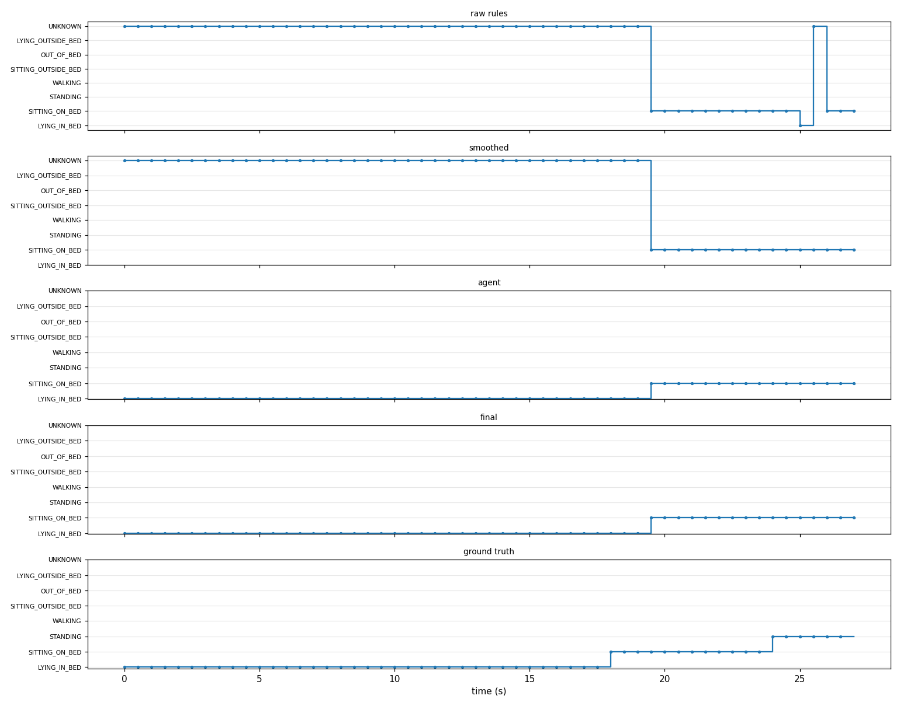


### Evaluation

Frame accuracy: **0.833** over 54 sampled frames.


| stage | accuracy | unknown_frames |
|---|---|---|
| raw rules | 0.167 | 40 |
| + smoothing | 0.167 | 39 |
| + agent (VLM) | 0.833 | 0 |
| + state machine | 0.833 | 0 |


Duration error


| state | ground_truth_sec | predicted_sec | error_sec |
|---|---|---|---|
| LYING_IN_BED | 18.0 | 19.5 | 1.5 |
| SITTING_ON_BED | 6.0 | 7.7 | 1.7 |
| STANDING | 3.0 | 0.0 | 3.0 |


Bed events


| event | ground_truth | predicted | true_positives | precision | recall | false_detections_at |
|---|---|---|---|---|---|---|
| bed_exit | 1 | 0 | 0 | None | 0.0 | [] |
| return_to_bed | 0 | 0 | 0 | None | None | [] |


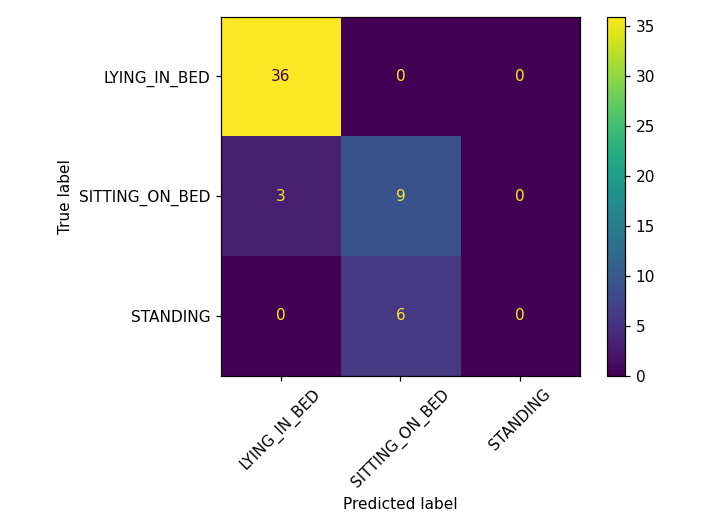


### Failure cases


**00:24–00:26**: truth `STANDING`, predicted `SITTING_ON_BED`. Features: {'people': 1, 'visible_kp': 14, 'torso_angle': 44, 'knee_angle': 137, 'hip_in_bed': True}. Why: TODO: explain the cause

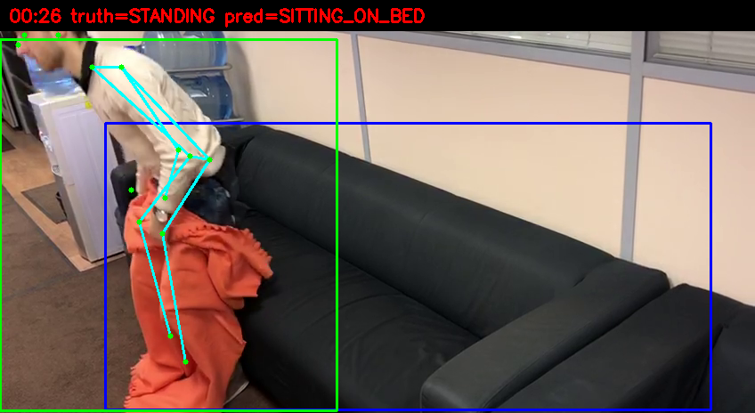


**00:18–00:19**: truth `SITTING_ON_BED`, predicted `LYING_IN_BED`. Features: {'people': 2, 'visible_kp': 0, 'torso_angle': None, 'knee_angle': None, 'hip_in_bed': None}. Why: TODO: explain the cause

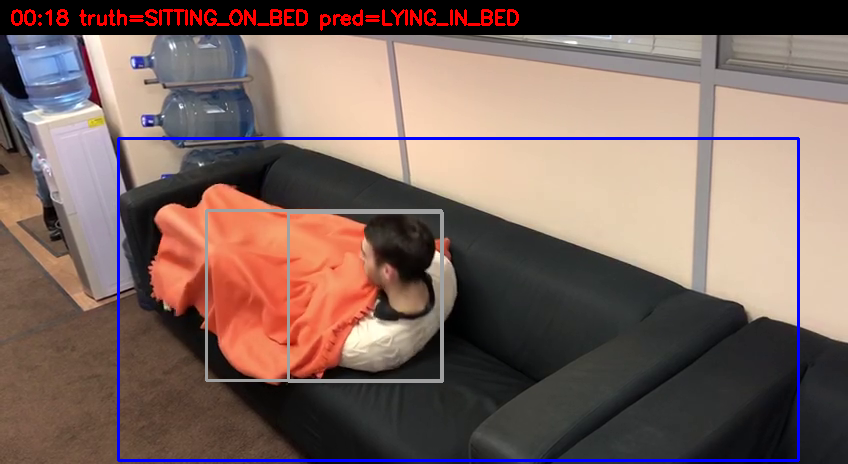


## IMG_5674

### Timeline
```
00:00 - 00:04  LYING_IN_BED
00:04 - 00:20  STANDING
```

### Activity summary
```json
{
  "total_observation_time": "20s",
  "activity_summary": {
    "lying_in_bed": "4s",
    "standing": "17s"
  },
  "bed_summary": {
    "time_in_bed": "4s",
    "time_out_of_bed": "17s",
    "bed_exit_count": 1
  }
}
```

```json
{
  "observation_duration_sec": 20.5,
  "activity_duration_sec": {
    "lying_in_bed": 3.5,
    "standing": 17.0
  },
  "bed_exit_count": 1,
  "bed_return_count": 0,
  "total_in_bed_sec": 3.5,
  "total_out_of_bed_sec": 17.0,
  "longest_out_of_bed_period_sec": 17.0,
  "final_state": "standing",
  "overall_decision": "NORMAL"
}
```

### Bed events

| event | start_time | confirmed_time | previous_state | current_state | confidence | assisted | decision |
|---|---|---|---|---|---|---|---|
| bed_exit | 00:00:04 | 00:00:06 | lying_in_bed | standing | 0.92 | True | NORMAL |


### Alerts (overall: NORMAL)

_none_


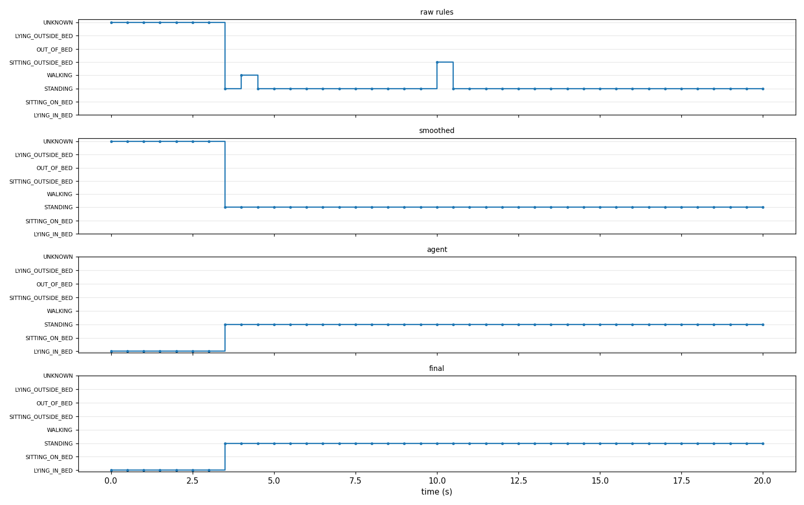


### Evaluation

Frame accuracy: **0.325** over 40 sampled frames.


| stage | accuracy | unknown_frames |
|---|---|---|
| raw rules | 0.15 | 7 |
| + smoothing | 0.15 | 7 |
| + agent (VLM) | 0.325 | 0 |
| + state machine | 0.325 | 0 |


Duration error


| state | ground_truth_sec | predicted_sec | error_sec |
|---|---|---|---|
| LYING_IN_BED | 14.0 | 3.5 | 10.5 |
| SITTING_ON_BED | 3.0 | 0.0 | 3.0 |
| STANDING | 3.0 | 17.0 | 14.0 |


Bed events


| event | ground_truth | predicted | true_positives | precision | recall | false_detections_at |
|---|---|---|---|---|---|---|
| bed_exit | 1 | 1 | 0 | 0.0 | 0.0 | ['00:00:04'] |
| return_to_bed | 0 | 0 | 0 | None | None | [] |


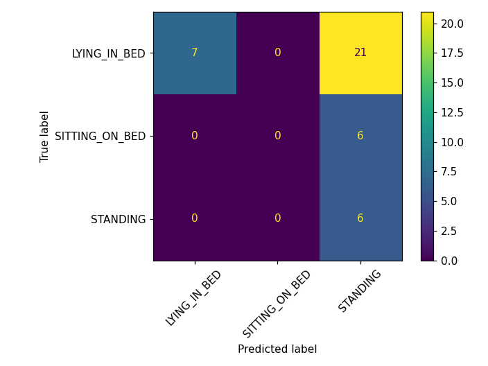


### Failure cases


**00:04–00:16**: truth `LYING_IN_BED`, predicted `STANDING`. Features: {'people': 2, 'visible_kp': 15, 'torso_angle': 78, 'knee_angle': 137, 'hip_in_bed': False}. Why: TODO: explain the cause

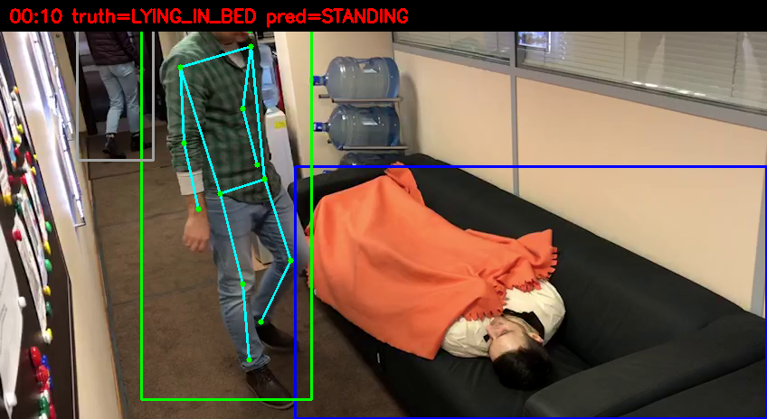
